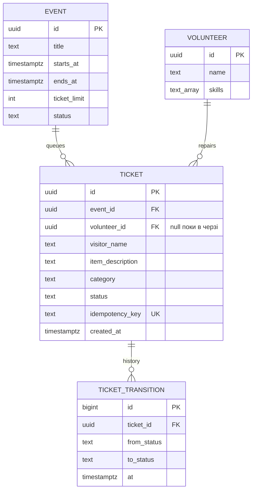

# Spec — Repair Café (Лаба 1: структура)

**Що і навіщо.** HTTP API черги ремонтів на сесіях Repair Café. Інваріанти: (I1) у кожної речі
в роботі рівно один майстер, і він уміє лагодити її категорію; (I2) майстер має ≤ 1 річ `in_repair`;
(I3) активних речей у сесії ≤ `ticket_limit`; (I4) повтор реєстрації не створює дубль.

## 1. Модулі та межі

| Модуль               | Відповідальність                                   | Може залежати від                    |
| -------------------- | -------------------------------------------------- | ------------------------------------ |
| `modules/events`     | сесії кафе: час, ліміт черги, відкрита/закрита     | `shared`                             |
| `modules/volunteers` | майстри та їхні навички                            | `shared`                             |
| `modules/tickets`    | черга речей, взяття в роботу, машина статусів      | `shared`, API `events`, `volunteers` |
| `platform`           | HTTP (Fastify), мапінг помилок, версія             | `shared`, API модулів                |
| `config`             | єдине місце читання `process.env`                  | —                                    |
| `shared`             | `DomainError`, `Id`, **`Category`** (спільне ядро) | —                                    |
| `app.ts`             | composition root                                   | усе                                  |

Всередині модуля: `domain.ts` (типи + чисті правила) → `service.ts` (сценарії) → `ports.ts`
(інтерфейси сховищ; реалізації — Лаба 2). **Правила меж:** (R1) інший модуль — лише через `index.ts`;
(R2) `domain.ts` залежить лише від `shared`; (R3) модулі не імпортують `platform`; (R4) `shared` — лист;
(R5) без циклів. Поняття, потрібне доменам двох модулів, живе в `shared`. Усе перевіряє `make deps`.

## 2. Дані

Статуси: `queued → in_repair → fixed | not_fixable | needs_parts`; `needs_parts → queued`;
`queued | needs_parts → withdrawn`. Активні = `queued | in_repair | needs_parts`. Записи не видаляються.

## 3. Як дані оновлюються

- **Зареєструвати річ** (`tickets.register`): є тікет з цим `idempotency_key` → повернути його → сесія існує й `open` (`NOT_FOUND`/`CONFLICT`) → активних < ліміт (`CONFLICT`) → `INSERT status=queued`. Підрахунок + вставка — одна транзакція (Лаба 2).
- **Взяти в роботу** (`tickets.claim`): тікет існує → майстер існує → навичка ∋ категорія (`VALIDATION`) → у майстра немає речі `in_repair` (`CONFLICT`) → перехід дозволений → `UPDATE … WHERE status='queued'`; 0 рядків = хтось встиг першим (`CONFLICT`).
- **Завершити** (`fixed`/`not_fixable`/`needs_parts`): перевірка переходу → оновлення + рядок у `TICKET_TRANSITION`.

## 4. Критерії прийняття (Лаба 1)

- [x] AC1 `make check` зелений: формат, лінт, типи, архітектура R1–R5, smoke, збірка.
- [x] AC2 Брудний коміт блокується hook-ом — `make hook-demo` → `OK`.
- [x] AC3 `GET /health` → 200; `GET /version` → поточний git sha.
- [x] AC4 Структура `src/` дорівнює таблиці §1; порушення меж ловить `make deps`.
- [x] AC5 Помилки домену — `DomainError` з кодом; HTTP-статус визначає лише `platform`. Перевірка: smoke-тест.
